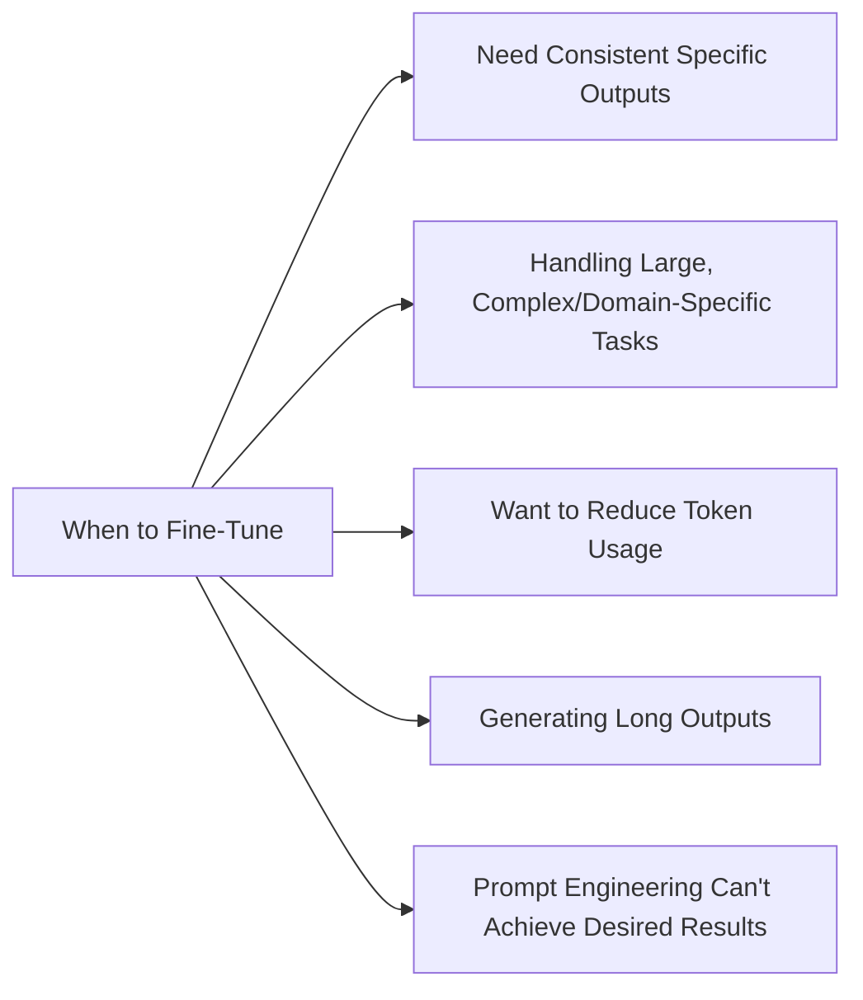
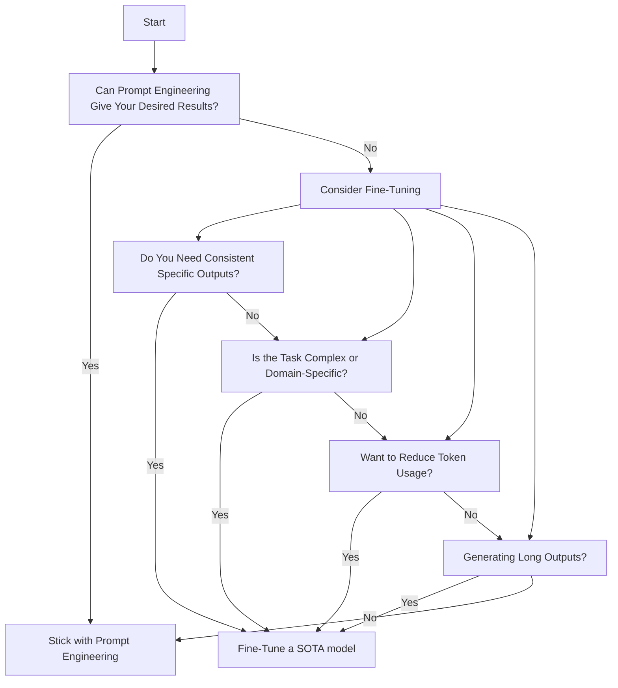

### Why and When to Fine-Tune an LLM:

*** When to Fine-Tune an LLM ***

### Fine-Tuning Decision Diagram

### Reasons to fine-tune
1. Consistency in specific outputs
   - Fine-tuning adjusts the model's internal weights, leading to more reliable and predictable responses across similar tasks
2. Handling complex or domain-specific tasks
   - When your application requires deep understanding of specialized fields, fine-tuning can significantly improve performance
3. Improved token efficiency
   - Fine-tuned models often require shorter prompts, reducing token usage and potentially lowering costs
4. Better performance on long outputs
   - Fine-tuning helps maintain coherence and adherence to instructions throughout longer generations
5. Overcoming limitations of prompt engineering
   - If you've tried structured outputs, have several examples, and are still not getting the results you're looking for, fine-tuning can force more consistent behavior across tasks

### Reasons not to fine-tune
1. When prompt engineering can achieve desired results
   - If you can get satisfactory performance through careful prompt design, fine-tuning may be unnecessary
2. For tasks that require quick iteration and feedback
   - Fine-tuning has a longer feedback loop compared to prompt engineering, making rapid experimentation more difficult
3. When the task doesn't require specialized knowledge
   - For general tasks where the base model's knowledge is sufficient, fine-tuning may not provide significant benefits

---
